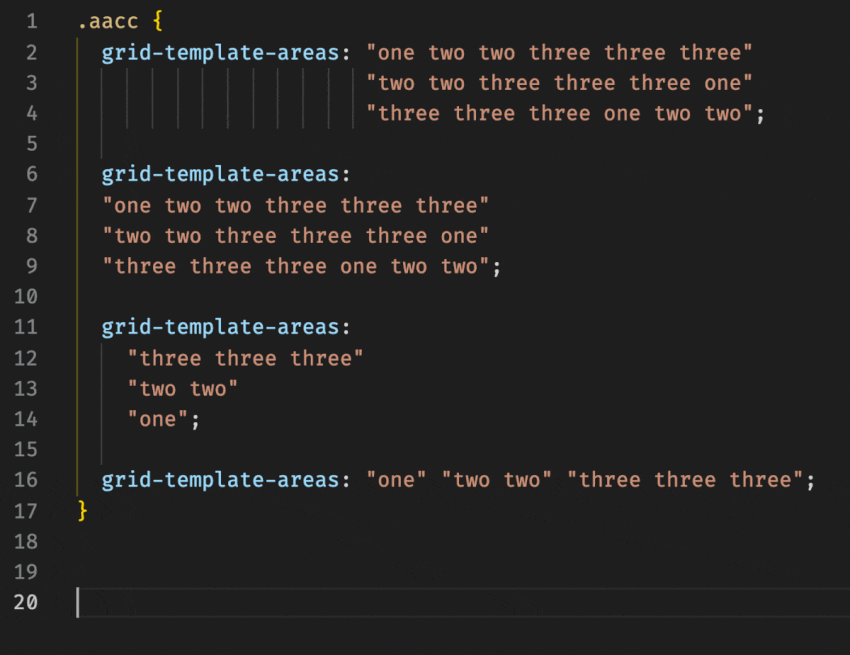

# Prettier Plugin CSS Grid

An opinionated CSS Grid formatter.

## Usage

```sh
npm i -D prettier-plugin-css-grid
```

> Note: Prettier will automatically detect this plugin and apply it to your code.


